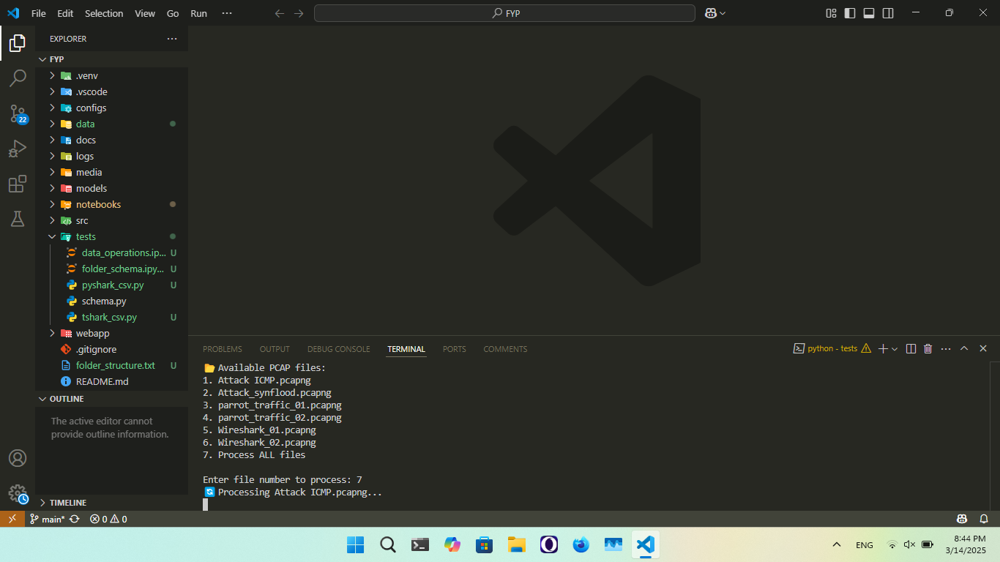

#### ***  [ Under Development ]***
# **Intrusion Detection System (IDS) Using Wireshark and Advanced Ensemble Learning Techniques**

***Clone the Repository if needed.***
 

## **📁 Project Info**
Visit `/docs/project_documentation.md` For details.

## **🟢 Assignment files F24PROJECTA686A (BC210427835)**

| **Project File** | **Status** | **Details** |
|-----------------|------------|------------|
| **1️⃣ SRS** | ✅ **Completed** | (Submitied on  `08DEC2024`),(Stored at `/docs`). |
| **2️⃣ Design Document** | ✅ **Completed** | (Submitied on  `03MAR2025`),(Stored at `/docs`). |
| **3️⃣ Prototype Phase** | ✅ **Completed** | Submitied on  `18MAR2025`. |
| **4️⃣ Final Deliverable** | ❌ **Incompleted** | Under Development. |

## **🟢 Steps Taken for Django webapp**

| **Django app Development** | **Status** | **Details** |
|-----------------|------------|------------|
| **1️⃣ Project** | ✅ **Completed** | (Handled in `webapp/IDS_Project`). |
| **2️⃣ webapp** | ✅ **Completed** | (Handled in `webapp/IDS`). |
| **3️⃣ Front End** | ✅ **Completed** | structure files (Handled in `webapp/IDS/templates/IDS`) design files (Handled in `webapp/IDS/static/css`). |

## **🟢 Steps Implemented for ML models**
| **Prototype Step** | **Status** | **Details** |
|-----------------|------------|------------|
| **1️⃣ Capture Network Traffic & Convert to CSV** | ✅ **Completed** | Wireshark captures `.pcap` files, which are converted to `.csv` (Handled in `notebooks/pcap_to_csv.ipynb`), (`.pcap`stored at `data/raw`), (`csv` stored at `data/processed`)  |
| **2️⃣ Data Preprocessing** | ✅ **Completed** | Data cleaning, encoding, and normalization (Handled in `notebooks/data_preparation.ipynb`) |
| **3️⃣ Final Dataset Creation** | ✅ **Completed** | Structured dataset with normal/malicious labels stored at **`/FYP/data/datasets/final_dataset.csv`**. |
| **4️⃣ Model Training (TabNet, CatBoost, LightGBM, Stacking Ensemble)** | ✅ **Continue** | Each model trained separately (Handled in `notebooks/TabNet.ipynb`, `CatBoost.ipynb`, `LightGBM.ipynb`, `Stacking_ensemble.ipynb`). |
| **5️⃣ Model Evaluation (Metrics Calculation & Comparison)** | ❌ **Incompleted**  | Evaluation script implemented (Handled in `notebooks/evaluation_metrics.ipynb`). |

## **🟡 Under Development**
1. **Getting more data using wireshark**
2. **Training Models**  

## **🔴 Not completed yet**
1. **Connecting ML Trained models to webapp** to ensure user can interact with app. 
2. **Fine-tune the models** for better performance?
3. **Final Report**
4. **Final Presentation**

## **📁 Folder Schema**

[text](folder_structure.txt)
### **. Common Git Commands for Future Use**
| Command | Description |
|---------|------------|
| `git status` | Check repo status (modified, staged, committed files) |
| `git add .` | Stage all changes |
| `git commit -m "message"` | Commit changes with a message |
| `git push origin main` | Push changes to GitHub |
| `git pull origin main` | Fetch and merge latest changes from GitHub |
| `git log --oneline` | Show commit history |

---

<h1 style="font-family: 'poppins'; font-weight: bold; color: Green;">👨‍💻Author: MAHBOOB ALAM</h1>

 
 
  
 

inshallah will be finalized till 09MAY2025! 🚀